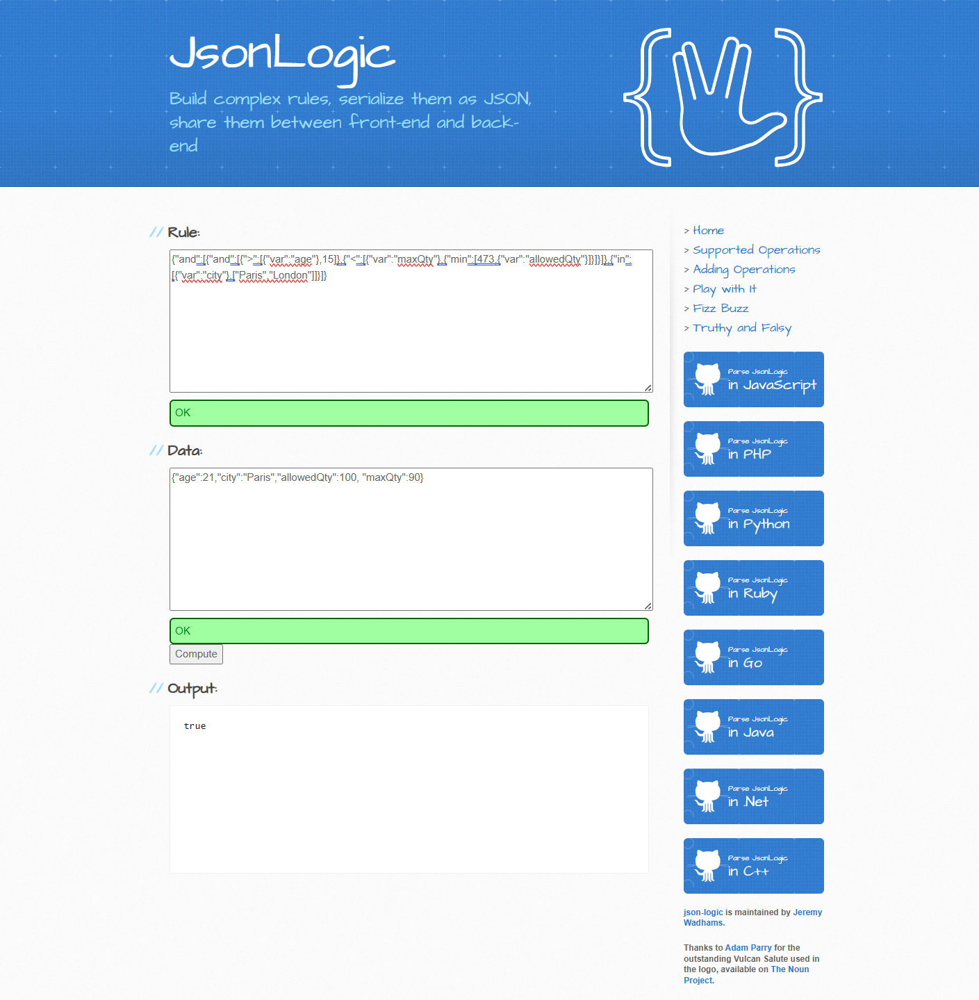

# Expr2JLogic - Transforming Expression to JSONLogic for Evaluation

This project aims to develop a robust system that converts plain text expressions into JSONLogic format, enabling seamless evaluation and execution of logical operations. This innovative solution will bridge the gap between human-readable expressions and machine-executable logic, providing a versatile tool for developers, data analysts, and decision-makers.

## Key Features:

- Text Parsing: Efficiently parse and interpret plain text expressions.
JSONLogic Conversion: Transform parsed expressions into JSONLogic format.
- Evaluation Engine: Execute the JSONLogic to derive results based on the given expressions - https://jsonlogic.com/play.html
- Extensibility: Support for a wide range of logical operations and functions.

## Use Cases:

- Data Validation: Automate validation rules for data entry and processing.
- Decision Making: Implement complex decision-making logic in business applications.
- Automation: Streamline workflows by automating logical evaluations.

This project will empower users to leverage the power of JSONLogic without needing deep technical expertise, making logical evaluations more accessible and efficient.

